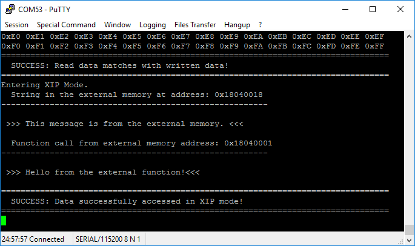
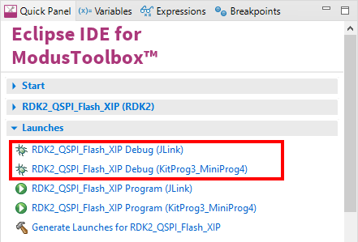

# RDK2 QSPI NOR Flash XIP Example

Rutronik Development Kit Programmable System-on-Chip CY8C6245AZI-S3D72 "QSPI NOR Flash XIP" Example. 

This example demonstrates how to use serial flash library and XIP (execute-in-place) feature.

 

## Requirements

- [ModusToolbox® software](https://www.infineon.com/cms/en/design-support/tools/sdk/modustoolbox-software/) v3.0

### Using the code example with a ModusToolbox IDE:

1. Import the project: **File** > **Import...** > **General** > **Existing Projects into Workspace** > **Next**.
2. Select the directory where **"RDK2_QSPI_Flash_XIP"** resides and click  **Finish**.
3. Update libraries using  a **"Library Manager"** tool.
4. Select and build the project **Project ** > **Build Project**.

### Operation

Firstly, the QSPI NOR Flash memory is initiated using the "Cypress Serial Flash" library. Then the third 256KB sector is erased, programmed and validated with the generated data. If data comparison results are positive the firmware enables XIP mode and tries to execute a function from the external NOR Flash memory programmed earlier together with MCU firmware in internal memory.




This example has the custom linker script included into the project : *qspi_xip_rutdevkit.ld*. the make file is modified to use custom linker scripts:

`LINKER_SCRIPT=./qspi_xip_rutdevkit.ld`

Also the define is needed to be declared in the linker script to enable the code to be programmed into the external memory during the programming process:

`DEFINES=CY_ENABLE_XIP_PROGRAM`

The Cypress Semper Flash S25HL512T has a special first sector which is not used in the example, hence the linker script is modified to program the external flash only from the second sector (please note that third sector is used in this example to test the serial flash library functions while not in XIP mode):

```
SECTIONS
{
	.reserved :
	{
		. += 0x40000;
	} > xip
	
    .cy_xip_code :
    {
        KEEP(*(.cy_xip_code))
    } > xip 
    
    /*code continues*/
```


### Debugging

If you successfully have imported the example, the debug configurations are already prepared to use with a the KitProg3, MiniProg4, or J-link. Open the ModusToolbox perspective and find the Quick Panel. Click on the desired debug launch configuration and wait untill the programming completes and the debugging starts.



## Legal Disclaimer

The evaluation board including the software is for testing purposes only and, because it has limited functions and limited resilience, is not suitable for permanent use under real conditions. If the evaluation board is nevertheless used under real conditions, this is done at one’s responsibility; any liability of Rutronik is insofar excluded. 


